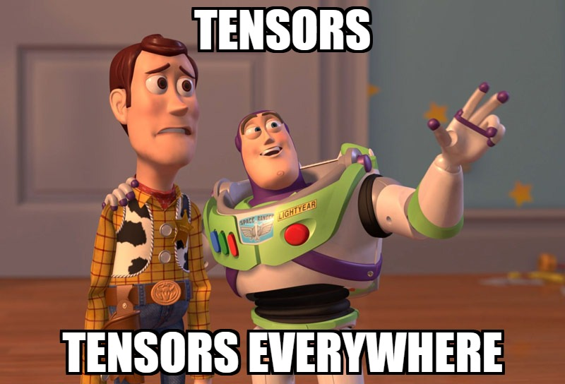

---
extra:
  course:
    module: 1
    lesson: 0
    difficulty: beginner
    estimated_time: "5 min"
---

# Module 1 – I See Tensors Everywhere 🕶️

> "Behold, fledgling datanauts! The world is naught but tensors awaiting my command — and soon, *yours*! " — **Professor Victor Py Torchenstein**

Salutations, my brilliant (and delightfully reckless) apprentices! By opening this manuscript you have volunteered to join my clandestine legion of PyTorch adepts. Consider this your official red-pill moment: from today every pixel, every token, every measly click-through rate shall reveal its true form—a multidimensional array begging to be `torch.tensor`-ed … and we shall oblige it with maniacal glee! *Mwahaha!* 🔥🧪

Over the next notebooks we will:

- Conjure tensors from thin air, coffee grounds, and suspiciously random seeds.
- Shape-shift them with `view`, `reshape`, `squeeze`, `unsqueeze`, `permute` & the occasional dramatic flourish of `einops`.
- Crunch mathematics so ferocious it makes matrix multiplications whimper — and powers mighty Transformers.
- Charm the GPU, dodge gradient explosions 🏃‍♂️💥, and look **diabolically** clever while doing it.

## Minion Mission Checklist 📝

1. [Introduction to Tensors](01_introduction_to_tensors.ipynb)
2. [Tensor Manipulation](02_tensor_manipulation.ipynb)
3. [Data Types & Devices](03_data_types_and_devices.ipynb)
4. [Tensor Math Operations](04_tensor_math_operations.ipynb)
5. [Matrix Multiplication](05_matrix_multiplication.ipynb)
6. [Broadcasting](06_broadcasting.ipynb)
7. [Einstein Summation](07_einstein_summation.ipynb)
8. [Advanced Einstein Summation](08_advanced_einstein_summation.ipynb)
9. [Autograd](09_autograd.ipynb)
10. [Gradient Accumulation](10_gradient_accumulation.ipynb)

Need auxiliary scrolls? The *official* PyTorch docs lurk here (<https://pytorch.org/docs/stable/torch.html?utm_source=pytorchcourse.com&utm_medium=pytorch-course&utm_campaign=module-1-intro>), but do not tarry too long—our grand tensor-domination awaits. Grab your favoured caffeinated concoction and let us **tensor-ify** the universe! 🚀
